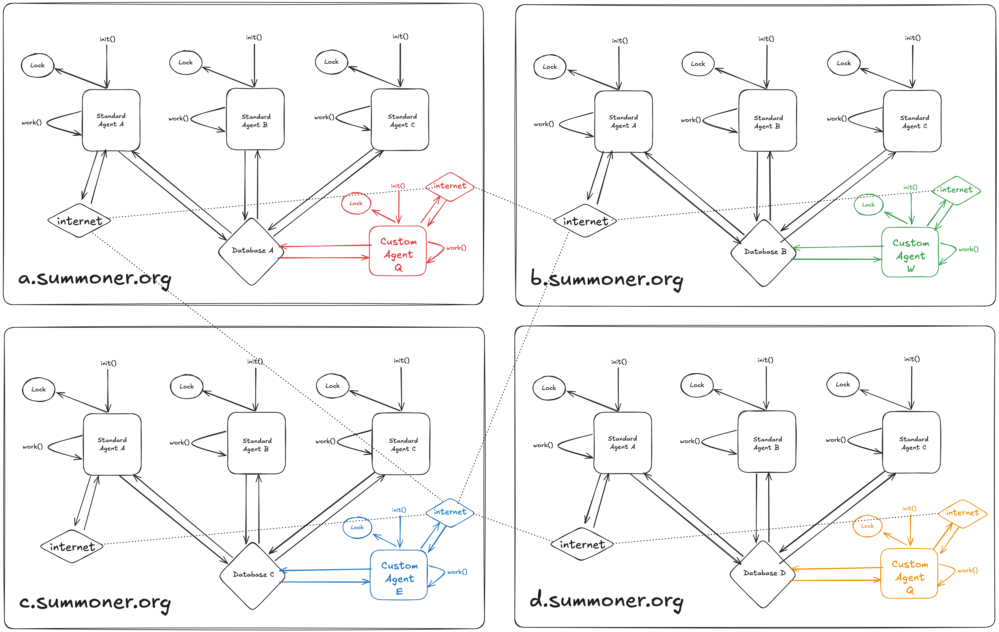

# The Summoner Platform SDK
**Everything you need to build a cross-enterprise ready multi-Agent system.**

```
 _______           _        _       
(  ____ \|\     /|( \      ( \      
| (    \/| )   ( || (      | (      
| (__    | |   | || |      | |      
|  __)   | |   | || |      | |      
| (      | |   | || |      | |      
| )      | (___) || (____/\| (____/\
|/       (_______)(_______/(_______/
                                    
 _______  _______  ______   _______ 
(  ____ \(  ___  )(  __  \ (  ____ \
| (    \/| (   ) || (  \  )| (    \/
| |      | |   | || |   ) || (__    
| |      | |   | || |   | ||  __)   
| |      | |   | || |   ) || (      
| (____/\| (___) || (__/  )| (____/\
(_______/(_______)(______/ (_______/
                                    
 _       _________ _______  _______ 
( \      \__   __/(  ____ \(  ____ \
| (         ) (   | (    \/| (    \/
| |         | |   | (__    | (__    
| |         | |   |  __)   |  __)   
| |         | |   | (      | (      
| (____/\___) (___| )      | (____/\
(_______/\_______/|/       (_______/
                                                           
```


---

**Summoner is not a typical platform.** We have specifically engineered it, with great discipline, so that you (the developer) can clone our stack and run it locally. You will be running and testing your multi-agent system in the equivalent of a full production environment, so that you can deploy with confidence.

**Still not confident?** That's fine: we have a _[staging environment](https://staging.summoner.org)_ where you can deploy your agents and witness them working in the cloud with all the associated latency and connectivity required to do that. However, in order to utilize the staging environment you will need to develop your agent under the same strict discipline that made the platform possible: absolutely zero extra imports beyond the standard Python SDK are allowed.

---

# 1. Start by cloning and running our full stack.
Visit the `frontend` [here](https://github.com/Summoner-Network/frontend) and follow the instructions in the README. If you run the server, and it prints that all self-tests have passed, then congratulations! You know for a fact that our code is working perfectly in your local environment. If it is not working, let us know in the [Discord](https://discord.gg/AAYuyThmsw) server. We will get it rectified so that you may continue making progress. _It should always just work!_

---

# 2. Continue by cloning this repository.
Leave the stack running. It is happy to do work and have things thrown at it no problem, you shouldn't need to touch it. If you do decide to touch it for good reasons, please open an issue to contribute to the `frontend` repository so that we can absorb your helpful contribution.

This repository contains everything you need to develop agents within the platform, alongside the platform itself (which you have running locally)!

---

# 3. What is an Agent?

"Wow, that is an excellent question!" Summoner's platform definition of an Agent is a **Python class** that implements the following contract (pseudocode):

```python
# Implemented by the developer
await agent.init(script_config, shard_config)
while True: # Managed by the platform
  # Implemented by the developer
  await agent.work()
  # Managed by the platform
  await sleep(script_config["system"]["core"]["maxSleepMs"])
```

See [example](./src/starters/agent_0_printer/agent.py).

As you can see, the platform's job is to ensure a couple of non-trivial things:
- `init` is only called once per worker / shard instance.
- Only one instance of a shard is "working" at any given time.
- The `work` function is called _as frequently as the "max sleep" allows_ (may be 0).
  - Note that this is the MAX SLEEP, not a guarunteed sleep. It is not possible for the platform to guaruntee a fixed period of sleep, because it is a distributed fleet of _replicated_ workers, not a single worker.
  - If one worker fails, another immediately takes over by following the above routine. There is no complicated coordination: there is a perpetual [livelock](https://stackoverflow.com/questions/6155951/whats-the-difference-between-deadlock-and-livelock) ("logjam") to run the agent across the whole fleet.

**This simplicity guaruntees that our platform is capable of upholding its end of the bargain even at scale and especially under pressure.** It also allows you, _dear developer_, to build tremendous things without our substantial help.

---

# 4. What are you missing?

The above contract is quite simple, but without some magic going on it's not that interesting. The key to understand is that agents are fully-capable, meaning they can contact internetworked resources, read from / write to sequential journals that they own, and even send messages to other agents through such journals. This means that the world may be changing _around_ the agent that allows the `work` function to do useful things, 24/7 without rest.

Agents can also store and manage their own state. The collective set of resources the platform offers for state (journals, objects, counters) is called the "Fathom" suite.

# 5. What are the key restrictions?

**First (and foremost):** in most cases (unless you've got yourself a special private instance of our stack in the cloud, starting at $1,000/month) an Agent must be pure Python and have no external dependencies. This can feel crippling, but it's what allows us to offer a reliable and consistent service at scale for everyone. If you must use a dependency, use pip's `--target` argument to vendor that dependency into your project and use it directly. However, remember that **codespace** is a limited and expensive resource!

**Second:** Agents are limited to 4 GB of RAM. This is a technical restriction of their execution environment (WebAssembly). This is fine for most use-cases, especially if you take advantage of sharding. Anything that requires this much or more RAM on any consistent basis should be built at a service outside of the platform, which the Agent calls over to.

**Third:** Agents on the platform are **versioned** and **versions are immutable**. Agents can be deleted entirely, but this is subject to a 30-day delay in order to notify dependents and enhance security posture. This prevents supply-chain attacks plugging in malicious agent code to standing traffic flows. Deploying an agent is a special and substantial undertaking, so treat it as one; test well, and ensure your design is sound to ship for a long time. _Multiple versions of an agent can be active at the same time, but they have entirely separate state._

**Fourth:** Agents _entirely manage their own data integrity_, meaning there is no data mutation without going through the Agent's `work` contract. This eliminates massive classes of catastrophic security risks should an API key become compromised, when combined with the versioned immutability of agents.

These restrictions are minimal in the context of cross-organizational automation, and they're what allow us to offer a `secure and stable` environment to everyone even in adversarial and suboptimal conditions!

---

# 6. What is the definition of a (Multi-)Agent System?
> The definition of a multi-agent system is a pure python project containing one or more `agent.py` files, each adjacent to a `config` folder, containing a `config.json` file and a `shards` folder, containing at least one json file.

To be clear, one minimal agent looks like this somewhere in the project directory structure:
- ./agent.py
- ./config
  - config.json
  - ./shards
    - 1.json